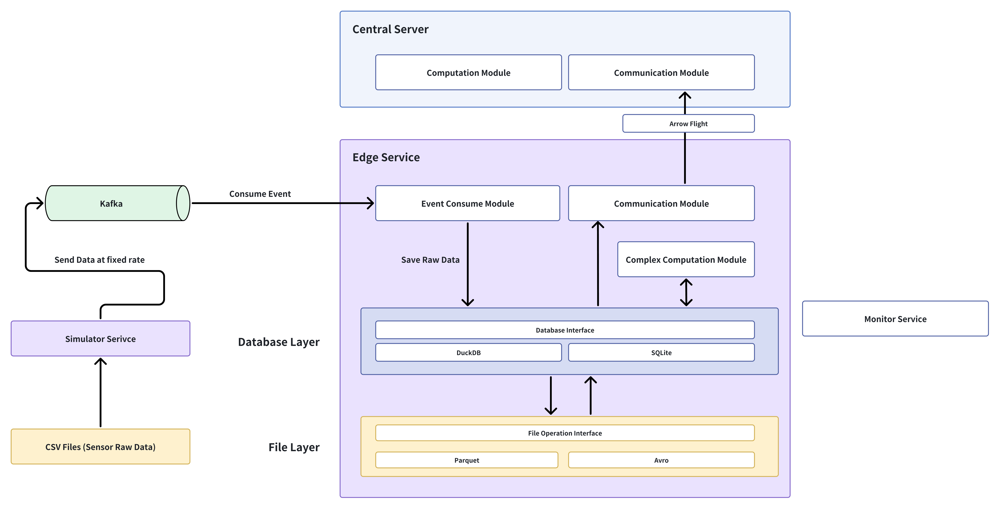

# Dataset

## Directly from Watch

At first, I tried to find Apple Watch datasets on Kaggle, like:

- [My Apple Watch Data - HeartRate, StepCount, etc](https://www.kaggle.com/datasets/daiearth22/applewatch)
- [Apple Health: Sleep Stages and Heart Rate](https://www.kaggle.com/datasets/aeryss/apple-health-sleep-stages-and-heart-rate)

But I soon found that there are some cons:

- lack of data, like heart rate in sleep time
- lack of original data, like acceleration, which is quite useful for analysis

We've talked about which edge device we are working on, as we thought we can only get data exported by Apple Watch, some of the data types definitely have already been processed by watch itself. Though the conclusion is it doesn't matter, if we have a chance to get original data from watch's sensors, we are pleased to use it.

Thankfully, we found:

- [Motion and heart rate from a wrist-worn wearable and labeled sleep from polysomnography v1.0.0](https://physionet.org/content/sleep-accel/1.0.0/): They designed a simple app to scrape acceleration data from an Apple Watch, also achieved continuous heart rate monitoring.
- [In-situ wearable-based dataset of continuous heart rate variability monitoring accompanied by sleep diaries](https://springernature.figshare.com/articles/dataset/In-situ_wearable-based_dataset_of_continuous_heart_rate_variability_monitoring_accompanied_by_sleep_diaries/28509740): They chose the Samsung Galaxy Active 2, also developed a wearable device application named “Heart+” to facilitate data collection.

All of them have original data from sensors, which is suitable for project studying on embedded devices. We could do research on many scenarios, like sleep scenario, daily scenario, exercise scenario.

I choose to use [In-situ wearable-based dataset of continuous heart rate variability monitoring accompanied by sleep diaries](https://springernature.figshare.com/articles/dataset/In-situ_wearable-based_dataset_of_continuous_heart_rate_variability_monitoring_accompanied_by_sleep_diaries/28509740) and sleep scenario for showing the whole process.

## Sleep Scenario Analysis

Actigraphy-like sleep analysis vs  Polysomnography (PSG)

> PSG is the gold standard for sleep assessment, recording brain, eye, muscle, heart, respiratory, and oxygen signals overnight. It enables precise sleep staging and diagnosis of sleep disorders but is costly and limited to laboratory settings.

So if we want to do some analysis only on watch, maybe we can try Actigraphy-like sleep analysis.

We have original sensors' data:

- **ppg.csv.gz**: Photoplethysmography (green light reflection), the raw source for heart rate and HRV.
- **hrm.csv.gz**: Heart rate (likely PPG processed by the smartwatch algorithm).
- **acc.csv.gz**: 3-axis accelerometer.
- **grv.csv.gz**: Gravity orientation + rotation angle.
- **gyr.csv.gz**: 3-axis gyroscope.
- **lit.csv.gz**: Ambient light intensity.
- **ped.csv.gz**: Pedometer (walking steps, running steps, distance, calories).

Note: not all of the data are original, like *sensor_hrv.csv*:

> *sensor_hrv.csv* contains sensor and HRV measurements in 5-minute intervals, excluding periods when the device was off the wrist, no data was collected, or the signal was too noisy for reliable HRV extraction.

So you will find that it has done what we want to do. But we can do the same thing again with the sensors' data!

How to do these again:

- <https://www.nature.com/articles/s41597-025-05801-3>
- [Edge Device](Edge_Device.md)

### Sleep-related Metrics (not important)

Having these, we can calculate many things **in the end** (on the server), like:

Sleep-related Metrics

Note: These fields are learned from *sensor_hrv.csv*!

| Field                | Full Name                      | Meaning                                               | Calculation                                                                      |
| -------------------- | ------------------------------ | ----------------------------------------------------- | -------------------------------------------------------------------------------- |
| **go2bed**           | Go-to-bed time                 | The time the participant went to bed                  | Start of the longest low-activity segment during the night                       |
| **asleep**           | Sleep onset time               | Actual time of falling asleep                         | Detected when HR drops below threshold for several minutes, or fallback (+20min) |
| **wakeup**           | Final wake-up time             | Final wake-up in the morning                          | End of the longest detected sleep segment                                        |
| **wakeup@night**     | Number of awakenings           | Number of awakenings during the night (≥5min)         | Count of wake episodes between asleep and wakeup                                 |
| **waso**             | Wake After Sleep Onset (hours) | Total wake time after sleep onset until final wake-up | Sum of all wake episodes between asleep and wakeup                               |
| **sleep_duration**   | Total sleep duration (hours)   | Actual sleep time excluding wake episodes             | (wakeup – asleep) – WASO                                                         |
| **in_bed_duration**  | Time in bed (hours)            | Time from going to bed until final wake-up            | wakeup – go2bed                                                                  |
| **sleep_latency**    | Sleep latency (hours)          | Time it took to fall asleep after going to bed        | asleep – go2bed                                                                  |
| **sleep_efficiency** | Sleep efficiency               | Ratio of sleep duration to time in bed                | sleep_duration ÷ in_bed_duration                                                 |

Heart Rate Variability (HRV) Metrics

Note:

- **RR Interval**: the time interval between two consecutive **R waves** on the electrocardiogram (ECG/EKG), corresponding to the duration between two successive heartbeats. It includes both normal and abnormal beats.
- **NN Interval (Normal-to-Normal interval)**: a subset of RR intervals that only considers intervals between **normal sinus beats**. Abnormal beats (e.g., ectopic, missed, or artifact-related) are excluded. HRV metrics such as SDNN, RMSSD, pNN20, and pNN50 are conventionally defined on NN intervals.
- **IBI (Inter-Beat Interval)**: the time interval between two successive detected heartbeats, often derived from **PPG (photoplethysmography)** instead of ECG. After artifact removal and cleaning, IBIs can be treated as equivalent to NN intervals for HRV analysis.

| Field                 | Full Name                                    | Meaning                                                                              | Aggregation                                  |
| --------------------- | -------------------------------------------- | ------------------------------------------------------------------------------------ | -------------------------------------------- |
| **sdnn_median_ms**    | Standard Deviation of NN intervals           | Overall HRV measure, standard deviation of RR intervals                              | Computed per 5-min window, nightly median    |
| **sdsd_median_ms**    | Standard Deviation of Successive Differences | Std. deviation of successive RR interval differences                                 | Computed per 5-min window, nightly median    |
| **rmssd_median_ms**   | Root Mean Square of Successive Differences   | RMS of successive RR interval differences, reflects vagal (parasympathetic) activity | Computed per 5-min window, nightly median    |
| **pnn20_mean_pct**    | Proportion of NN intervals >20ms             | Percentage of successive RR differences >20ms                                        | Computed per 5-min window, nightly mean      |
| **pnn50_mean_pct**    | Proportion of NN intervals >50ms             | Percentage of successive RR differences >50ms                                        | Computed per 5-min window, nightly mean      |
| **hrv_valid_minutes** | Valid minutes of HRV analysis                | Total valid minutes included in HRV computation                                      | Sum of valid 5-min windows’ duration         |
| **hrv_coverage_pct**  | HRV coverage percentage                      | Percentage of valid HRV minutes relative to total sleep time                         | hrv_valid_minutes ÷ (wakeup – asleep) × 100% |

### A Sample Explanation (not important)

Note: Just tell us how we can explain the data (the data is fake).

Sleep-related (sample, 3 nights)

| userId | date       | go2bed   | asleep   | wakeup   | wakeup@night | waso | sleep_duration | in_bed_duration | sleep_latency | sleep_efficiency |
| ------ | ---------- | -------- | -------- | -------- | ------------ | ---- | -------------- | --------------- | ------------- | ---------------- |
| pm96   | 2025-09-12 | 23:45:00 | 00:10:00 | 07:10:00 | 1            | 0.4  | 6.6            | 7.4             | 0.42          | 0.89             |
| pm96   | 2025-09-13 | 00:30:00 | 01:05:00 | 08:30:00 | 2            | 0.9  | 6.5            | 8.0             | 0.58          | 0.82             |
| pm96   | 2025-09-14 | 00:20:00 | 00:35:00 | 08:05:00 | 0            | 0.1  | 7.4            | 7.8             | 0.25          | 0.95             |

HRV-related (sample, same nights)

| userId | date       | sdnn_median_ms | sdsd_median_ms | rmssd_median_ms | pnn20_mean_pct | pnn50_mean_pct | hrv_valid_minutes | hrv_coverage_pct |
| ------ | ---------- | -------------- | -------------- | --------------- | -------------- | -------------- | ----------------- | ---------------- |
| pm96   | 2025-09-12 | 48             | 34             | 36              | 46             | 18             | 285               | 68               |
| pm96   | 2025-09-13 | 41             | 28             | 29              | 33             | 10             | 240               | 54               |
| pm96   | 2025-09-14 | 55             | 39             | 42              | 52             | 22             | 320               | 71               |

Simulated Analysis

1. **Night 1 (2025-09-12)**
   - Total sleep: **6.6 h**, efficiency ~ **89%**.
   - HRV coverage: **68%** of valid 5-min windows → borderline (slightly below 70% threshold).
   - HRV metrics are reliable but coverage should be flagged.
2. **Night 2 (2025-09-13)**
   - Total sleep: **6.5 h**, efficiency ~ **82%** (more fragmented night).
   - HRV coverage: only **54%**, below acceptable threshold.
   - Flagged as **invalid for HRV-based analysis**.
3. **Night 3 (2025-09-14)**
   - Total sleep: **7.4 h**, efficiency ~ **95%** (good quality night).
   - HRV coverage: **71%**, above threshold.
   - Valid HRV analysis possible.

## Initial Implementation

Keep in mind that what we need to do is do research about **database + data format + query on embedded devices**.

Input: from ppg, hrm, acc, grv, lit sensors, offer data per ms (for example)

In this scenario, we have a edge device and a server:

- Edge will gather data from sensors, do aggregation (in certain time window) and some calculation (like calculate HRV)
- Server will send queries to the edge / receive data from edge, and do more analytics.

However, in this project we focus on **edge**, so there will be some key points:

- We only care about edge device's aggregation and calculation tasks (leaving queries from server / send data to the server)'
- We don't need to implement a server.



### Step 0. Raw Dataset Preprocessing

Before streaming or database ingestion, we need to prepare the large dataset (≈18 GB). The goal is to **restructure raw files into subject-level, time-sorted, sensor-stream-compatible subsets**, so they can later be “replayed” to mimic real devices.

**Tasks:**

1. **Split by subject**
   - Separate each participant’s records into independent folders (e.g., `user01/ppg.csv.gz`, `user01/acc.csv.gz`).
   - This mirrors the reality that data is generated per device/person.
2. **Sort by timestamp & unify timezone**
   - Ensure all records are sorted chronologically.
   - Align timestamps to a single standard (e.g., UTC), correcting drift if needed.
3. **Normalize formats**
   - Convert to a common schema (e.g., `[ts, value1, value2, …]`) per sensor type.
   - Drop unused metadata fields, compress if necessary.
4. **Quality control & filtering**
   - Remove duplicate rows.
   - Handle missing or corrupted samples (NaN, impossible values).
   - Mark artifact-prone windows (e.g., motion artifact in PPG).
5. **Segment by session/day**
   - Optionally split each subject’s data into nightly/daytime chunks.
   - This helps later when replaying “one night of data” or evaluating batch processing.
6. **Prepare streaming-ready format**
   - Store cleaned data in efficient files (Parquet/Feather) or pre-seeded DuckDB.
   - These can then feed a simulator (script) that “emits” rows at the sensor’s native frequency.

[data_preprocess.py](Galaxy_Watch/data_preprocess.py)

```shell
python data_preprocess.py --input input/ppg.csv.gz --sensor ppg --out data_per_user --chunksize 1000000
python data_preprocess.py --input input/hrm.csv.gz --sensor hrm --out data_per_user --chunksize 1000000
python data_preprocess.py --input input/acc.csv.gz --sensor acc --out data_per_user --chunksize 1000000
python data_preprocess.py --input input/grv.csv.gz --sensor grv --out data_per_user --chunksize 1000000
python data_preprocess.py --input input/gyr.csv.gz --sensor gyr --out data_per_user --chunksize 1000000
python data_preprocess.py --input input/lit.csv.gz --sensor lit --out data_per_user --chunksize 1000000
python data_preprocess.py --input input/ped.csv.gz --sensor ped --out data_per_user --chunksize 1000000
```

---

Simulated Data Generation (CSV → SQL → Kafka → Aggregator)

**Goal:** Reproduce device-like, ordered, per‑second sensor streams from the large offline dataset.

**Pipeline overview:**

1. **ETL to SQL** — Clean the raw CSV files and load them into a SQL database (e.g., PostgreSQL/SQLite/DuckDB), one table per sensor per subject (or a unified wide table with `sensor_type`).
2. **Producer process** — A long‑running process scans the SQL tables in timestamp order and **publishes per‑second batches** to a message queue (e.g., Kafka/Redpanda/Pulsar). Rate is enforced by wall‑clock sleeps or async timers.
3. **Aggregation service ("watch")** — A consumer service subscribes to the topics, performs minute‑level and 5‑minute HRV aggregation, and writes results to storage.

**Topics & keys:**

- Topic naming: `<subject>.<sensor>` (e.g., `pm96.ppg`, `pm96.acc`).
- Message key: `<subject>` to guarantee **in‑partition ordering**. Use partitions per subject or per sensor to scale.

**Message schema:**

```json
{
  "ts": "2025-09-12T00:10:00.120Z",
  "sensor": "ppg",
  "values": [123, 118, 121],
  "seq": 1723456,     // optional, monotonically increasing per topic
  "source": "dataset-v1",
  "meta": {"unit": "a.u.", "tz": "UTC"}
}
```

### Step 1. Lightweight On-device Aggregation

**Goal:** reduce data volume and preserve essential features with minimal CPU/RAM/battery.

- **Per-minute metrics:** average HR, step count, activity intensity, light exposure, posture.
- **Per-5-minute HRV metrics:** basic indicators (e.g., RMSSD, SDNN) from cleaned PPG-derived RR/IBI windows.
- **Formats & engines:** store summaries using a lightweight DB (DuckDB/SQLite) or columnar files (Parquet/Arrow).
- **Pipeline:** *produce → append → (optionally) preview simple queries → upload*. No heavy multi-night calculations on device.

### Step 2. Data Model with Edge–Server Split

**On-device (compact):**

- **Minute-level table:** `(device_id, date, minute_ts, hr_avg, steps, activity_intensity, light, posture, validity)`
- **5-min HRV table:** `(device_id, date, window_start_ts, rmssd, sdnn, coverage_ratio, validity)`
- Designed for **incremental, bandwidth-friendly** uploads; rows marked as `synced` after success.

**Server-side (rich):**

- Ingest edge summaries, then compute **advanced HRV** (pNN20/pNN50 distributions, nightly medians), **sleep metrics** (go2bed/asleep/wakeup/WASO/efficiency), and quality flags.
- Produce the two **final report tables** referenced earlier (Sleep-related & HRV-related).

### Step 3. Embedded Query & Storage Design (Edge)

- **Storage choices:**
  - *DuckDB (file-backed)* for simple SQL on summaries; *SQLite* for smallest footprint; *Parquet/Arrow* for append-only + fast upload.
- **Append-only writes:** minute & 5-min rows are appended as produced; avoid rewriting history.
- **Partitioning / keys:** primary keys by `(device_id, date, minute_ts)` / `(device_id, date, window_start_ts)`; partition by `date/user` for columnar files to simplify uploads.
- **On-device queries (keep trivial):**
  - Night low-activity scan; “upload only new rows” via `synced=false` or `ts > last_committed_ts`.
- **Retention:** keep **7–14 days** of summaries; discard high-frequency raw buffers after aggregation.
- **Quality, privacy:** per-row `validity/coverage_ratio`; daily `clock_drift_ms`; at-rest + in-transit encryption; PII-free (pseudonymous `device_id` only).

### Step 4. Uplink, Validation & Final Outputs (Server)

- **Uplink/ingestion:** accept Parquet/Arrow/SQL batches; idempotent upsert keyed by `(device_id, ts)`; return `last_committed_ts` for device sync.
- **Enrichment & analysis:** recompute/extend HRV (pNN20/pNN50, nightly medians), detect **sleep windows** (go2bed/asleep/wakeup), compute **WASO/latency/efficiency**, and finalize **coverage**.
- **Validation:** range/gap/monotonic checks; coverage thresholds (e.g., nightly HRV coverage ≥70% ⇒ “valid”); consistency of sleep windows.
- **Outputs:**
  - **Sleep-related table:** `go2bed, asleep, wakeup, wakeup@night, waso, sleep_duration, in_bed_duration, sleep_latency, sleep_efficiency`.
  - **HRV-related table:** `sdnn_median_ms, sdsd_median_ms, rmssd_median_ms, pnn20_mean_pct, pnn50_mean_pct, hrv_valid_minutes, hrv_coverage_pct`.
- **Lifecycle:** raw optional for reprocessing and later tiering; summaries stay hot for dashboards and nightly materialized views.
